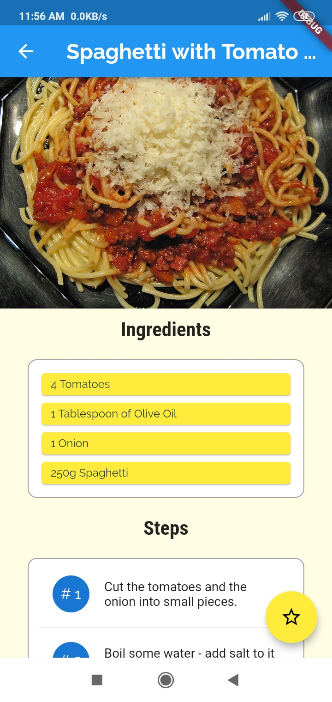

# Meal-App-using-flutter (Android and ios app)

1.	Cross platform app developed using flutter framework
2.	Responsive and adaptive user interface created using flutter.
3. It has bottom navigation and drawer features.
4. It has filter settings.user can filter meal based on their preferences. 
5.	Allows user to manage their favorite meal through various kinds of meal and to give the proper recipe and ingredients
to cook that meal

